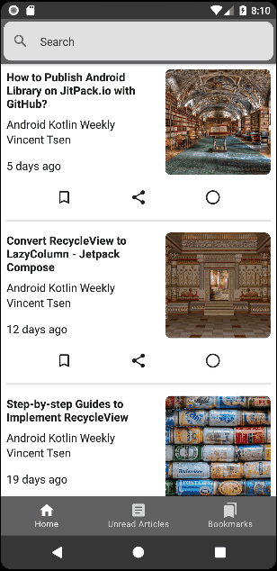

# Simple RSS Feed Reader (Android Kotlin Weekly)

This is a simple RSS feed reader app that currently reads my blog (Android Kotlin Weekly)'s feed - [rss.xml](https://vtsen.hashnode.dev/rss.xml). It is written in Kotlin and Jetpack Compose.

> This app is work in progress and may be over-engineered to showcase the best pratices and diverse array of technologies.

## Features
- Fetch articles from RSS feed
- Bookmark articles
- Share articles
- Mark articles as read / unread
- Search articles
- New article arrived notification
- Deep link support for all article URLs

## Current Status
- Get rid of search screen, implement real-time articles filter

## Requirements
- Android Studio Electric Eel or later

## Tech Stack
| Tech Stack | High-level Implementation Description |
| --- | --- |
| [Jetpack Compose](https://developer.android.com/jetpack/compose) | Implement reactive UI using composable functions | 
| [Recommended App Architecture ](https://developer.android.com/topic/architecture) | Seperate the app into UI, domain and data layers |
| [ViewModel](https://developer.android.com/topic/libraries/architecture/viewmodel) | Act as state holder in UI layer (expose state as `StateFlow`) Survive through configuration changes |
| [OkHttp](https://square.github.io/okhttp/) |Fetch rss.xml Replace [Ktor Client](https://ktor.io/docs/getting-started-ktor-client.html) which crashes on API 21 |
| [Room Database](https://developer.android.com/training/data-storage/room) | Cache the article data from the rss.xml |
| [Proto DataStore](https://developer.android.com/topic/libraries/architecture/datastore) | Store user preferences - e.g. bookmarked articles, read articles |
| [Coil](https://github.com/coil-kt/coil) | Load images from URL |
| [XmlPullParser](https://developer.android.com/reference/org/xmlpull/v1/XmlPullParser) | Parse the rss.xml |
| [Compose Navigation](https://developer.android.com/jetpack/compose/navigation) | Navigate to different screens in the app |
| [Scaffold](https://developer.android.com/reference/kotlin/androidx/compose/material/package-summary#scaffold) | Implement top, bottom and snack bars based on material design layout Implement navigation graph |
| [AndroidView](https://developer.android.com/reference/kotlin/androidx/compose/ui/viewinterop/package-summary#AndroidView) & [WebView](https://developer.android.com/reference/android/webkit/WebView) | Embed the web browser into the app |
| [Coroutines](https://kotlinlang.org/docs/coroutines-overview.html) | Implement asynchronous flow in the app |
| [Flow](https://kotlinlang.org/docs/flow.html) | Expose `Flow` in data layer |
| [StateFlow](https://kotlinlang.org/api/kotlinx.coroutines/kotlinx-coroutines-core/kotlinx.coroutines.flow/-state-flow/) | Expose `StateFlow` in `ViewModel` |
| [Accompanist System UI Controller](https://google.github.io/accompanist/systemuicontroller) | Set system bars color |
| [PullRefresh](https://developer.android.com/reference/kotlin/androidx/compose/material/pullrefresh/package-summary) | Show article referesh indicator (was migrated from Accompanist `SwipeRefresh`) |
| [WorkManager](https://developer.android.com/topic/libraries/architecture/workmanager) | Schedule background tasks to fetch articles from rss.xml |
| [Notification](https://developer.android.com/develop/ui/views/notifications) | Post new article arrived notification |
| [Deep Link](https://developer.android.com/training/app-links/deep-linking) | Add main blog, article and about URL deep links into the app Implement partial deep links(link is not verified due to I don't own the blog's domain) |
| [BuildUtils](https://github.com/vinchamp77/buildutils) (own library) | Avoid hardcoding build version code (API level) to improve code readability |
| [New Splash Screen](https://developer.android.com/develop/ui/views/launch/splash-screen) | Implement new splach screen based on API >= 31 that works on all previous API levels |

## Articles
- [Simple RSS Feed Reader - Jetpack Compose](https://vtsen.hashnode.dev/simple-rss-feed-reader-jetpack-compose)
- [Simple Jetpack Compose Navigation Example](https://vtsen.hashnode.dev/simple-jetpack-compose-navigation-example)
- [Convert View Model to Use Hilt Dependency Injection](https://vtsen.hashnode.dev/convert-view-model-to-use-hilt-dependency-injection)
- [Implement Default Splash Screen Prior to Android 12](https://vtsen.hashnode.dev/implement-default-splash-screen-prior-to-android-12)
- [Simple Example to Use WorkManager and Notification](https://vtsen.hashnode.dev/simple-example-to-use-workmanager-and-notification)

## Branches
- [master](https://github.com/vinchamp77/AndroidNews) - multiple view models (use recommended way to collect flow)
- [master_org](https://github.com/vinchamp77/AndroidNews/tree/master_org) - single view model (previous implementation)
- [master_org_hilt](https://github.com/vinchamp77/AndroidNews/tree/master_org_hilt) - convert view model to use hilt ([diff](https://github.com/vinchamp77/AndroidNews/compare/129e75036178fa2427e7283a605ada6e7fa27325..a23b2dfc36447be82339fb26d9a3e1a36108fb4a)) 

